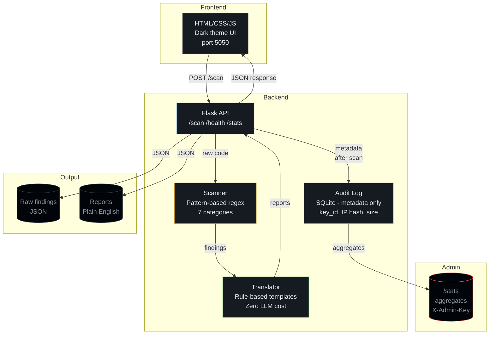

# NeuralScan — Security Scanner for AI-Generated Code

> 1 in 3 AI-generated projects (Cursor, Lovable, Bolt, Claude Code) ships with exposed secrets or security vulnerabilities. NeuralScan catches them and explains how to fix them — in plain English.

[](https://github.com/alexcurpan-cloud/neuralscan/actions)
[](https://www.python.org/)
[](LICENSE)
[](https://neuralscan-production.up.railway.app)

---

## Table of Contents

- [Who is this for](#who-is-this-for)
- [What it detects](#what-it-detects-7-categories)
- [How it works](#how-it-works)
- [Architecture](#architecture)
- [Quickstart](#quickstart)
- [API](#api)
- [Tests](#tests)
- [Deploy](#deploy)
- [Roadmap](#roadmap)

---

## 🎯 Early Access

Be among the first to try NeuralScan.
[👉 Join the waitlist](https://tally.so/r/D4EaAb)

---

## Who is this for

**Non-developers** who build with AI tools and can't read code well enough to know if it's safe.

Developers already have `gitleaks` + `semgrep`. NeuralScan's edge = **translation + trust**. No jargon, no terminal required, actionable fix prompts you can paste back into your AI agent.

---

## What it detects (7 categories)

| Category | Severity | Example |
|----------|----------|---------|
| 🔴 Exposed secrets | Critical | API keys, AWS keys, JWT tokens, passwords |
| 🔴 SQL injection | Critical | String concatenation in database queries |
| 🔴 Command injection | Critical | `os.system()` with dynamic input |
| 🟠 Debug mode / RCE | High | `debug=True` + `host=0.0.0.0` in production |
| 🟠 Path traversal | High | `open(f"/data/{user_input}")` |
| 🟡 Weak cryptography | Medium | MD5, SHA1, DES, RC4 |
| 🔵 Unencrypted HTTP | Low | `http://` instead of `https://` |

## How it works

```
┌─────────────┐     ┌──────────────┐     ┌──────────────────┐     ┌─────────────────┐
│ Paste code  │────→│ NeuralScan   │────→│ Plain-English    │────→│ Fix prompt      │
│ or upload   │     │ scanner      │     │ report           │     │ → back to AI    │
└─────────────┘     └──────────────┘     └──────────────────┘     └─────────────────┘
                         │
                         ↓
                    ┌──────────┐
                    │ 7 regex  │
                    │ patterns │
                    └──────────┘
```

1. **Input**: paste code or upload a file
2. **Scan**: 7 regex pattern families detect secrets, injections, weak crypto, and more
3. **Translate**: each finding is mapped to a plain-language explanation + fix prompt
4. **Output**: severity badge, code snippet, explanation, and a one-click fix prompt

> All scanning happens locally. Nothing is stored or sent to any third party.

---

## Architecture



### Project structure

```
neuralscan/
├── src/
│   ├── app.py              # Flask server + web UI + /stats
│   ├── scanner.py          # 7 regex pattern families
│   ├── translator.py       # Plain-language report generator
│   └── audit.py            # SQLite audit log (metadata only) + aggregates
├── tests/
│   ├── __init__.py
│   ├── test_scanner.py     # Scanner tests
│   ├── test_app_security.py# Security hardening tests (Strat 0+1)
│   ├── test_audit_log.py   # Audit log + /stats tests (Strat 2)
│   └── conftest.py         # Shared test config (env + DB)
├── docs/
│   ├── quickstart.md       # Getting started guide
│   └── deploy.md           # Deployment options
├── samples/
│   ├── sample_vulnerable.py  # Code with intentional vulnerabilities
│   ├── sample_clean.py       # Clean code (0 findings expected)
│   ├── vuln_app/             # Vulnerable Flask app (Strix target)
│   └── vuln_app2/            # Vulnerable app + users.db (Strix target)
├── start_local.py          # Local runner (injects keys from .secrets.json)
├── neuralscan_check.py     # One-command health check
├── README.md
├── requirements.txt
├── pyproject.toml
└── .gitignore
```

---

## Quickstart

```bash
# Install
pip install -r requirements.txt

# Start server (port 5050)
python src/app.py

# Open http://localhost:5050 in your browser
# Or scan via API:
curl -X POST http://localhost:5050/scan \
  -H 'Content-Type: application/json' \
  -d '{"code": "API_KEY = \"sk-proj-...\"", "filename": "test.py"}'
```

### Web UI

Open `http://localhost:5050` — dark theme, paste your code, click **Check**, read your report in plain English, copy the fix prompt.

---

## API

| Endpoint | Method | Description |
|----------|--------|-------------|
| `/` | GET | Web UI |
| `/scan` | POST | Scan code — body: `{ "code": "...", "filename": "optional.py" }` |
| `/health` | GET | Server status |
| `/stats` | GET | Audit stats (aggregate) — requires `X-Admin-Key` header |

### Audit log (v2)

Every scan writes **metadata only** to a local SQLite DB (`audit.db`):
key id, hashed IP (never raw IP), code size, finding counts, duration, status.
Raw code is **never stored**. `/stats` exposes aggregates (per day / per key)
to the admin key only — never to testers.

### Scan response

```json
{
  "status": "ok",
  "file": "test.py",
  "total": 3,
  "summary": { "critical": 2, "high": 0, "medium": 1, "low": 0 },
  "findings": [
    { "type": "hardcoded_api_key", "severity": "critical", "line": 1, ... }
  ],
  "report": [
    {
      "severity": "🔴 CRITICAL",
      "titlu": "Hardcoded API key found in source code",
      "explicatie": "A secret API key is written as plaintext...",
      "fix_prompt": "Move the API key to an environment variable...",
      "snippet": "> 1: API_KEY = \"sk-proj-...\""
    }
  ]
}
```

---

## Tests

```bash
python -m pytest tests/ -v
# 36 passed in 0.52s
```

Covers: all 7 detection categories, clean code (zero false positives), edge cases (namespace URLs, batch eval, parameterized queries), translator output format, file scanning, deduplication.

---

## Deploy

| Method | Details |
|--------|---------|
| **Railway** (live) | [neuralscan-production.up.railway.app](https://neuralscan-production.up.railway.app) — deploy permanent |
| **Local** | `python src/app.py` → `http://localhost:5050` |
| **Railway / Render** | Set start command to `gunicorn src.app:app` |
| **VPS** | Any Python-capable server, reverse proxy with nginx |

See [`docs/deploy.md`](docs/deploy.md) for detailed instructions.

---

## Roadmap

- [x] MVP — 7 categories, 36 tests, plain-English reports
- [x] Derisk — validated on real projects, zero false positives
- [x] Live deploy — Railway (stable URL: neuralscan-production.up.railway.app)
- [ ] File upload (zip / directory scan)
- [ ] GitHub repo scan (public repos)
- [ ] CI/CD integration (GitHub Action)
- [x] Waitlist — Tally form live
- [ ] Monetization — freemium tier

---

## Built with

- **Python** + **Flask** — lightweight API server
- **Regex** — pattern-based detection, zero ML cost
- **Railway** — free permanent hosting, stable public URL
- **GitHub** — open source (coming soon)

Built in Brașov, for non-developers everywhere.

---

## License

MIT — do whatever you want with it.
